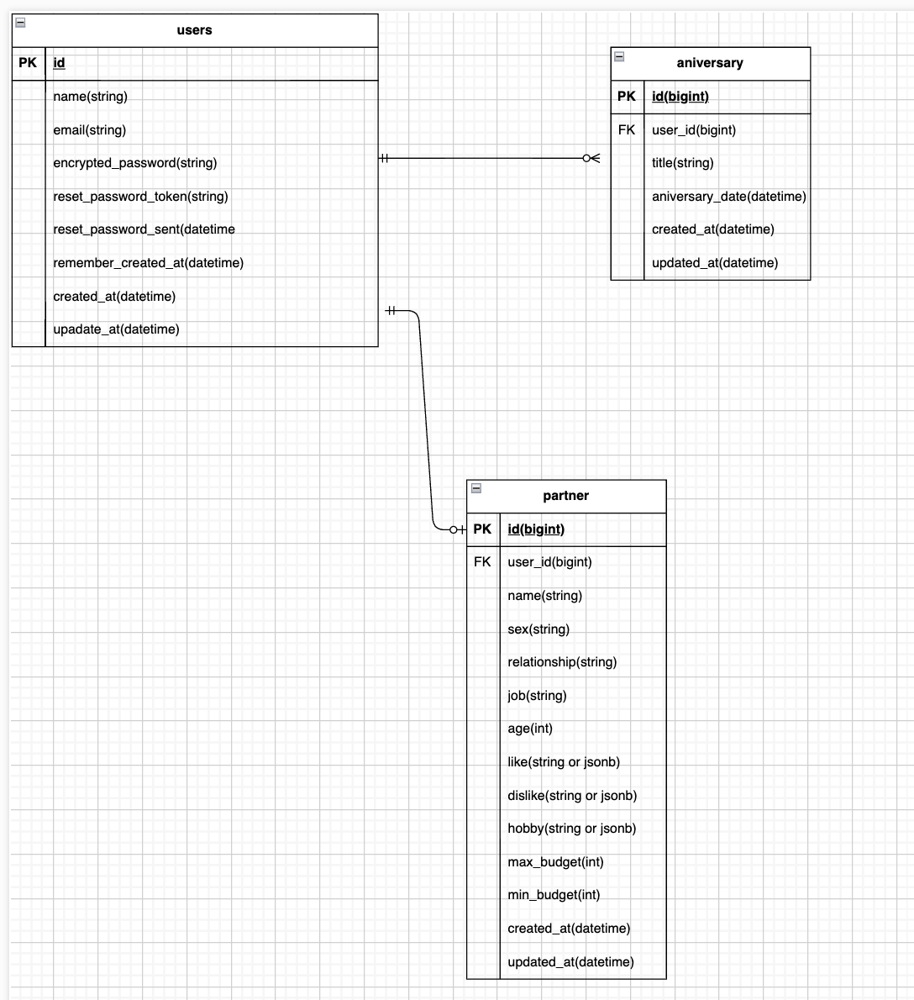

# README
## サービスについて
忙しい人向けに、記念日を登録するとLINEでリマインドして「うっかり忘れ」を防ぎ、喧嘩の種を減らします。
さらに、パートナーの好みや予算をもとに、AIがプレゼント候補を3つ提案します。
忙しくても「忘れない＋選べる」をまとめて支えるアプリです。

## このサービスへの思い・作りたい理由
忙しくなるにつれて、うっかり記念日を忘れてしまったことがあり、少し喧嘩になりそうになった経験があります。記念日が近いことに気づいてから慌ててプレゼントを準備しようとしても、仕事や予定に追われて十分な時間が取れず、「もっとちゃんと準備したかったのに…」というモヤモヤが残りました。

また、一応カレンダーで通知は設定していたのですが、日々の予定や他のアプリの通知に埋もれてしまい、肝心なタイミングで気づけないことが多かったです。結局、気づくのが遅れて焦る→準備が雑になる→気まずい空気になる、という経験も...

同じことを繰り返したくなくて、「記念日が近づいたら確実に気づける形でリマインドしてくれて、プレゼントを準備する期間も前もって確保できて、そのうえ何を選べばいいかまで提案してくれる」...そんな仕組みがあれば、忙しい中でも大切な人をちゃんと大事にできると思い、このアプリを作ろうと考えました。

## ユーザー層について

- 忙しい社会人カップル      
- 子育て中の夫婦

## サービスの利用イメージ
ユーザーがこのサービスをどのように利用できて、それによってどんな価値を得られるかを簡単に説明してください。
ユーザーは、アプリに記念日を登録し、「何日前から通知が欲しいか」を設定する。すると、すると、記念日が近づくタイミングでLINEに通知が届き、忙しい中でも忘れずにお祝いの準備ができます。
さらに、パートナーの好みや予算などを事前に登録しておくことで、必要なときにボタンひとつでプレゼント候補を提案してくれるため、迷わずスムーズに選べます。結果として、記念日の忘れと準備不足を減らし、大切な人との関係をより良くしてくれます。

## サービスの差別化ポイント・推しポイント
1.前倒し通知がポイントで、準備期間を十分に確保！
既存のアプリは、記念日通知自体用意されているものの、多くは当日〜直前に続ける、共有カレンダーで管理できるといったリマインドが中心。
formineでは準備期間を確保するために、何日前から通知するかを設計の中心に置いている。忙しい人ほど、思いだしてから準備する時間がないので、前倒しで気づけること自体が価値になる。

2. 通知で終わらない！プレゼント提案まで
通知で記念日を思いだしても、次に詰まるのは何を送るかどうか。既存のアプリではここがユーザー任せになりがちですが、formineでは候補を３つ提案してくれる！リマインド-> 準備->　提案までが一つの流れになっていて、忙しい人が行動に移しやすい。

３.通知の柔軟性が高く、生活に合わせて鬱陶しくなりにくい
毎日、隔日、週など頻度を選べることで、ユーザーは自分の忙しさに合わせて通知を調節できます。通知が多くて嫌になったり、少なすぎて忘れたり、という両方を避けられます。

## 機能候補
### MVP
- ユーザー登録

- ログイン・ログアウト（devise）

- 記念日CRUD(タイトル、日付)

- パートナーCRUD（名前、性別、関係性、職業、年齢、すきのこと、嫌いなこと、趣味、最大予算、最低予算）

### 本リリースで実装する機能
1) 認証・連携（安全に運用できる状態）

- LINEログイン

- 連携コード方式でLINE通知宛先を紐付け（友だち追加＋本人確認の導線）

2) 記念日管理（使い続けられる最低限の完成）

- 記念日CRUD（タイトル／日付／  毎年 or 1回のみ（この機能はいらないかも））

- 記念日の一覧・詳細（次に来る順など）

3) 通知機能（完成形）

- 通知ルール（ユーザーに1つ）

    - 何日前から（例：2025/1/12）

    -  頻度（毎日／隔日／週）

    - 時刻は一時間ごとに指定可能（０時〜２３：００）

- LINEまとめ通知（1通）

    - 対象記念日をまとめて送信

    - アプリへのリンク付き＋（プレゼント提案へ誘導、プレゼント選んだかな？みたいな文章があってもいい）

- 二重送信防止・再送制御

    - 送信ログを保存し、同じ日に重複送信しない

4) プレゼント提案

- パートナー情報（1人）登録・編集・削除

    - 好み／趣味／NG／予算（最大）/名前/性別/職業/年齢/関係性

- プレゼント提案ボタン

    - AIが候補3つ＋理由＋検索用キーワードを提示（楽天APIなどつかうなら：未定）

- 提案履歴の保存・閲覧・削除（後から見返せる）

5) 運用・品質（本番として最低限）

- 通知送信ログ（成功/失敗/スキップ、エラー内容）（必須）

- ジョブ全体の実行ログ（動いたか、何件処理したか）（予定）

- エラー時の扱い（失敗時）

６）　JS操作
　- aiの表示待ちの「処理中」？
　- プレゼント提案ボタンの下画面に表示（ボタン＋結果）

７）　メモ機能　（予定）
　- 画像の投稿（Action StorageとS3使用）

８）追加予定候補
　-　スヌーズ機能
  - Webhookを用いて画面でプレゼントと入力したら、アプリ内に入らなくてもプレゼント提案

    

## 使用する技術スタック・導入ライブラリ（for mine）
- バックエンド / 言語・フレームワーク

    - Ruby 3.2.2 + Ruby on Rails 7.2.x

- データベース

    - PostgreSQL（Supabase）

- 認証・ログイン

    - Devise

    - OmniAuth + omniauth-line

- 通知 / メッセージ送信

    - LINE Messaging API (LINE 公式アカウントから通知を送信（定期通知・プッシュメッセージ）)

    - line-bot-api(LINE Messaging API を利用するため)

- プレゼント提案
　　　- OpenAI API

- バックグラウンドジョブ・定期処理

    - Sidekiq — バックグラウンドジョブ（非同期処理）

    - Redis (sidekiqのバックエンド)

    - sidekiq-scheduler （定期ジョブ）

    - Render Cron Jobs（プラットフォーム側で定期実行 → Rails runner / rake を叩く）

-  フロントエンド

    - Bootstrap

    - Hotwire

- インフラ / デプロイ

    - Render — Web アプリ・ワーカー・Redis・PostgreSQL 

- バージョン管理・デザイン

    - Git / GitHub — ソースコード管理

    - Figma / Google Stitch — UI デザイン・プロトタイピング
        

## 画面遷移図

https://www.figma.com/design/MGJfkc1QbhnDlx8AkYw4U6/For_mine?node-id=0-1&p=f&t=YjYr3IvvrS0tawZZ-0

## ER図
