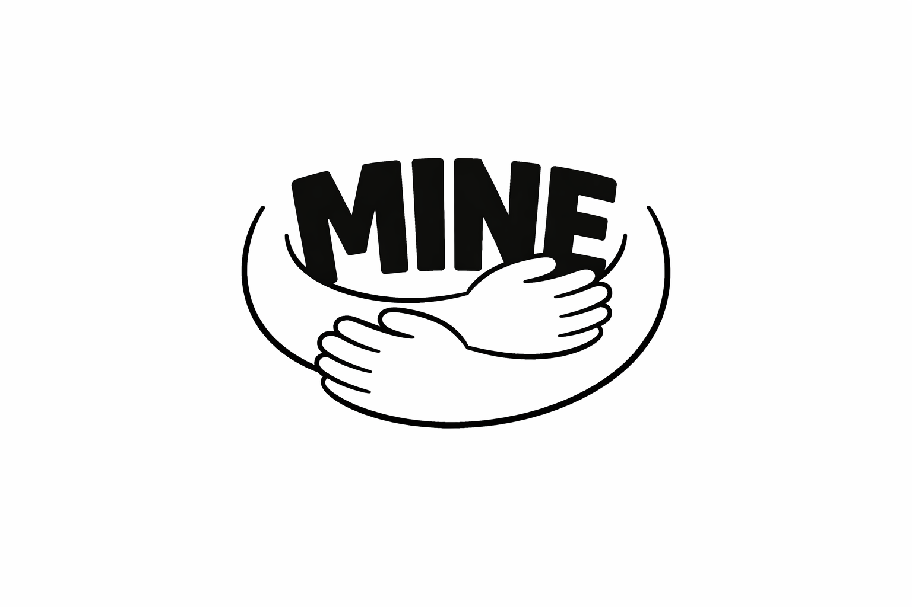
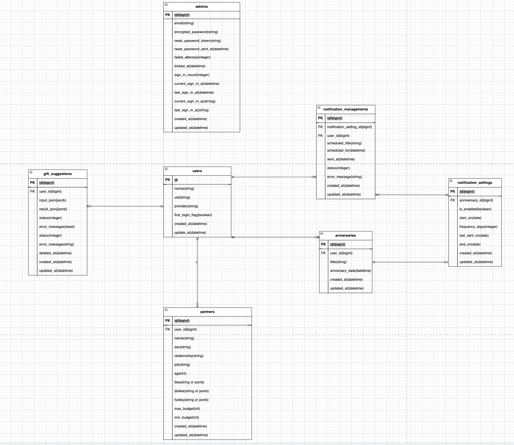

# 💣for mine
 
 

#  目次
- [サービス概要](#サービス概要)
- [サービスURL](#サービスurl)
- [サービス開発の背景](#サービス開発の背景)
- [ユーザー層](#ユーザー層について)
- [サービスの利用イメージ](#サービスの利用イメージ)
- [サービスの差別化ポイント・推しポイント](#サービスの差別化ポイント・推しポイント)
- [使い方](#使い方)
- [実装済み機能](#実装済み機能)
- [技術構成について](#技術構成について)
  - [使用技術](#使用技術)
  - [ER図](#ER図)
  - [画面遷移図](#画面遷移図) 
  

#  サービス概要
〜 あなたの大切な記念日をやさしく思い出させてくれる、プレゼント提案機能付きの記念日管理アプリ 〜 

『for mine』は、忙しい日々の中でも大切な記念日を忘れずに過ごせるようサポートするアプリです。  
通知機能によって記念日が近づいたことに気づきやすくし、プレゼント提案機能によって準備の負担を減らすことで、忙しい中でも大切な人との思い出を大切にできるよう支援します。
  

#  サービスURL
### https://www.for-mine.com 
  

# サービス開発の背景
大学生時代、新聞配達の仕事とテスト期間が重なり、忙しさから記念日に気づくのが遅れてしまった経験があります。記念日が近いことに気づいてから慌ててプレゼントを準備しようとしても、仕事やテスト勉強に追われて十分な時間が取れず、「もっとちゃんと準備したかったのに…」というモヤモヤが心に残りました。

また、カレンダーで通知は設定していたものの、日々の予定や他のアプリの通知に埋もれてしまい、気づけないこともありました。結果として、気づくのが遅れて焦る、準備が雑になる、相手を悲しませる、という経験もありました。

そこでまず、なぜ記念日に気づくのが遅れてしまうのか、またなぜ準備に時間がかかってしまうのかを考え、その原因を整理しました 
下記は、私が考える主な原因です。
- 仕事や予定に追われると、記念日を意識する余裕がなくなってしまう。
- カレンダーのプッシュ通知だけでは他の通知に埋もれ、気づくのが遅れることがある。
- 気づくのが遅れると、プレゼントや過ごし方を考える時間が足りなくなる。
- 相手の好みや欲しいものを十分に把握できていないと、何を準備すればよいか迷い、行動に移しづらくなる。

 
記念日が近づいたら確実に気づける形で知らせて、プレゼントを準備する期間も前もって確保できる。さらに、何を選べばいいかまで提案してくれる。そんな仕組みがあれば、忙しい中でも大切な人をしっかり大事にできると考え、このアプリを開発しました。

これらの課題を補い、忙しい中でも記念日を大切にできるようにするアプリが、『for mine』です。
  

#  ユーザー層について

- 忙しい社会人カップル      
- 子育て中の夫婦
  

#  サービスの利用イメージ
ユーザーは、アプリに記念日を登録し、通知開始日・通知時間・通知頻度を設定します。  
すると、設定したタイミングでLINEに通知が届き、忙しい中でも忘れずにお祝いの準備ができます。
さらに、パートナーの好みや予算などを事前に登録しておくことで、必要なときにボタンひとつでプレゼント候補を提案してくれるため、迷わずスムーズに選べます。結果として、記念日の忘れと準備不足を減らし、大切な人との関係をより良くしてくれます。
  

#  サービスの差別化ポイント・推しポイント
▼ LINE通知で気づきやすい 
一般的なアプリ通知では、プッシュ通知が多く、他の予定や通知に埋もれてしまい、見逃してしまうことがあります。『for mine』ではLINE通知で知らせることで、普段からよく使うコミュニケーション手段の中で気づきやすくし、記念日を見逃しにくくしています。

▼ 通知の柔軟性が高く、生活に合わせて鬱陶しくなりにくい 
毎日、隔日、週など頻度や通知時間を選べることで、ユーザーは自分の忙しさに合わせて通知を調節できます。通知が多くて嫌になったり、少なすぎて忘れたり、という両方を避けられます。

▼ 通知で終わらない！プレゼント提案まで 
通知で記念日を思いだしても、次に詰まるのは何を送るかどうか。既存のアプリではここがユーザー任せになりがちですが、formineでは候補を３つ提案してくれる！リマインド->準備->提案までが一つの流れになっていて、忙しい人が行動に移しやすい。
  

#   機能紹介

| ユーザー登録 / ログイン |
| :---: | 
| [ |
| 
ログインボタンを押すだけで、LINE認証により自動でユーザー登録・ログインが完了します。そのまますぐにサービスをご利用いただけます。  ※ログインはLINEのみ対応しています。
 |
 

| 記念日登録 |
| :---: | 
| [ |
| 
記念日を見るでは、「タイトル」と「記念日」を入力するだけで、簡単に登録できます。登録した記念日は、カレンダーやカード形式で直感的に確認できます。さらに、その記念日から経過日数も確認できます。
 |
 

| 通知設定 |
| :---: | 
| [ |
| 
記念日作成時に通知設定をONにすると、設定内容に応じてLINE通知が届くようになります。
 |
 

| パートナー登録 |
| :---: | 
| [ |
| 
パートナー情報では、大切な人の情報を登録できます。登録した情報が多いほど、プレゼント提案の精度が高まります。
 |
 

| プレゼント提案 |
| :---: | 
| [ |
| 
プレゼントを考える機能では、登録したパートナー情報をもとに、相手に合った３つのプレゼント候補と、その理由をAIが提案します。
 |
 

| プレゼント履歴 |
| :---: | 
| [ |
| 
プレゼントの記録では、これまでに提案されたプレゼント候補を確認できます。
 |
  

#   実装済み機能
▼ユーザー登録/認証

- LINEログイン

▼記念日管理

- 記念日CRUD（タイトル／日付）

- 記念日の一覧・詳細・編集削除

- カレンダーでの記念日確認

▼通知機能

- 通知設定

    - 通知設定: ON/OFF設定

    - 通知開始日：いつから通知がほしいか

    - 最終通知日（ユーザーは設定しない）；記念日から自動計算（閏年でない場合2/29は2/28日に設定）

    - 通知頻度：毎日/隔日/5日ごと/1週間ごと/30日ごと）

    - 通知時間：1時間ごとに指定可能（0:00 ~ 23:00）

    
- LINE通知

    - 設定した日に応じてLINE MESSAGE　APIで通知を送る

    - アプリへのリンク＋メッセージ（記念日まであとOO日）

▼通知管理

- 二重送信防止・再送制御

    - 送信ログを保存し、同じ日に重複送信しない

▼パートナー管理

- パートナー情報（1人）登録・編集・削除

    - 名前/性別/年齢/職業/関係性/好きなこと/苦手なこと/趣味/予算（下限）/予算（上限）

- プログレスバーでパートナー情報の登録率を確認

▼プレゼント提案

- プレゼント提案

    - パートナー情報をもとにプレゼントを提案

    - AIが候補3つ＋それぞれの理由（月に５回まで）

- 提案履歴の保存・閲覧・削除

▼運用・品質（本番として最低限）

- 通知送信ログ（成功/失敗/待機、エラー内容）

- プレゼント提案ログ（成功/失敗/削除、エラー内容）

- ジョブ全体の実行ログ（動いたか、何件処理したか、sidekiqでも確認）

▼JS操作(stimulus)

- aiの表示待ちの「処理中」

- 使い方ページのフェード表示

- 使い方ページのセレクターでの画面遷移

- 入力した記念日から次にくる記念日を計算
    - 例：今日が2025年3月10日で、記念日が2025年3月15日の場合 -> 2025年3月15日
    - 例：今日が2025年3月20日で、記念日が2025年3月15日の場合 -> 2026年3月15日

- パートナー削除時のモーダル確認  

- パートナーフォーム内で名前を入力する、もしくはしてあればプレゼント提案についての説明文章を表示

- トップページのスライダー
  

#   追加予定機能
 - 通知失敗時、再送信処理（別job作成）  
 - 毎月の記念日に通知が来るように（クエリオブジェクト作成）
    - 例：今日が2025年1月1日　-> 2025年2月1日に通知
 - webhookを用いて、通知をONを可能に
 - 次回に来る記念日計算をjs -> railsで行う 
  

#  技術構成について

##  使用技術
| カテゴリ | 技術内容 |
| --- | --- |
| バックエンド | Ruby 3.3.6 / Ruby on Rails 7.2.3 |
| フロントエンド | JavaScript / Hotwire（Turbo / Stimulus）
| CSSフレームワーク | Bootstrap |
| 非同期処理 | Sidekiq / sidekiq-cron |
| 外部API | OpenAI API (gpt-4o-mini) / LINE Login API / LINE Messaging API |
| データベース | PostgreSQL |
| インフラ | Render（Web Service /  Redis / PostgreSQL） |
| バージョン管理 | GitHub / Git Flow |
 
##  ER図
<!-- 
  -->

 
##  画面遷移図
https://www.figma.com/design/MGJfkc1QbhnDlx8AkYw4U6/For_mine?node-id=0-1&p=f&t=YjYr3IvvrS0tawZZ-0
 